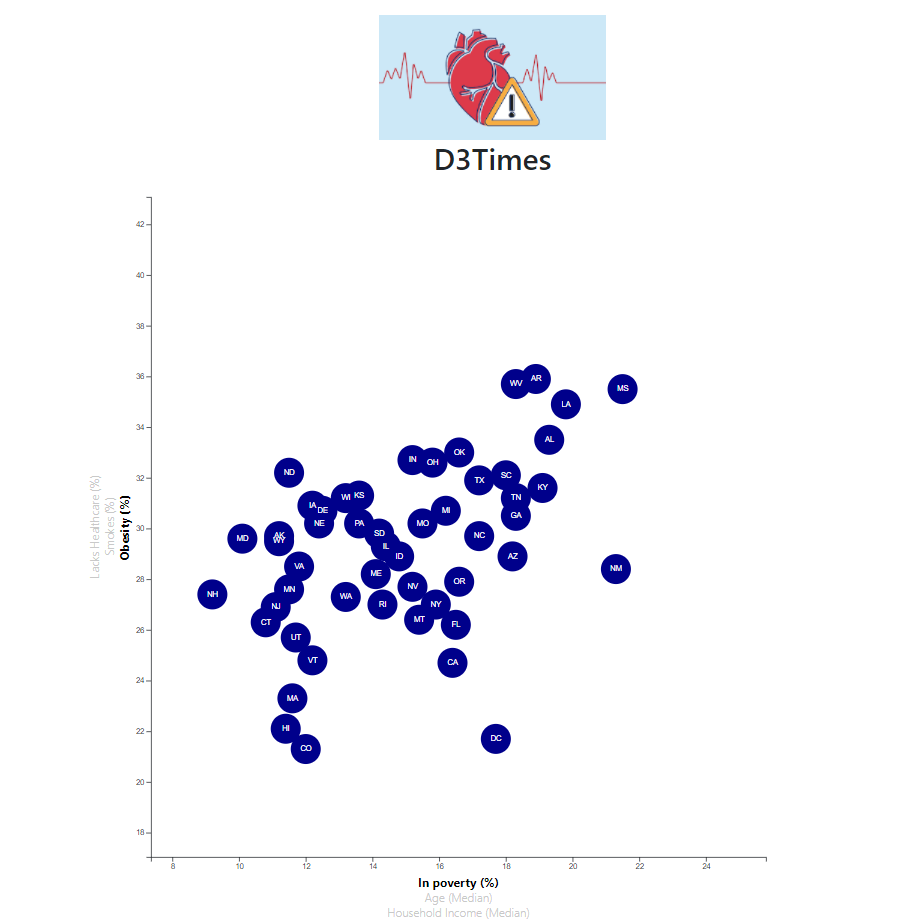

# **Employee Database: A Mystery in Two Parts**

In this assignment, the objective is to create scatter plot displaying several 'X' and 'Y' options. 
The scatter plot must allow users to select the preferred dataset from both axes, by clicking on its name.

  

  

## **1. Authors**

This project was created and authored by:
* **Latyr Thiao**

## **2. Requirements / Specifications**

The [business & technical requirements](01_Instructions) that must be met by the solution.

## **3. Prerequisites**

The mandatory steps to be taken to make the code work smoothly.

### **3.1 License & Key**

Not applicable

### **3.2 Installing**

The assumption here is that your computer is running on Windows 10.
Feel free to adjust if you are using a Mac OS or any other operating system.

What things you need to install the software and how to install them:

* Any web browser (Chrome, ...) 
* Anaconda/Python terminal
* Any IDE that enable to write or read code (VS Code, ...)

## **4. Tools & Coding Languages**

The following tools and coding languages were used:
* HTML
* JavaScript (d3)
* Css
* Bootstrap

## **5. Data Source(s)**

The data used as input is coming from the following sources:
* Link to .csv file [here](02_Data_Source/data.csv)

## **6. Run the code**

### **Step 1: The code is located here**
The code is available as follows:
* Part 1: [HTML](index.html)
* Part 2: [JavaScript](04_Js/app.js)
* Part 3: [CSS](03_Css/style.css) & [CSS](03_Css/d3Style.css)

### **Step 2: Extract all files & run the code**
* Download this entire project from Github
* Open VS Code or your IDE
* Choose 'File > Open Folder'
* Select the path to the folder located 1 level above the folder where the [HTML](index.html) is located. 
    * Example if your index file is located: Documents/.../Folder_Level_1_Above/15_Health_Risk_JavaScript_D3
    * Select: Folder_Level_1_Above
* Right click the folder that contains your [HTML](index.html), it should be named: 15_Health_Risk_JavaScript_D3
* Select: Open in integrated terminal
* It should open the terminal
* In the terminal do the following:
    * Type the command 'conda activate Your_Environment_Name' ; Your_Environment_Name is the name of your Python environment you defined
    * Run the server by typing the following: 'Python -m http.server'
    * Then, copy/paste this url (http://localhost:8000/) into your browser and press enter
* The page should load the charts and you can now selection menu or dropdown list to show the desired information
* Don't forget to shut down the server by closing your Python terminal in VS Code

## **7. User Acceptance Testing**

See related document to learn more about acceptence criteria:  
[UAT Excel File](003-User_Acceptance_Testing/User_Acceptance_Testing.xlsx)

## **8. Deployment**

* You could also deploy this entire folder to your preferred service provider (Github, ...) where a website can be hosted
* See [how to host a website on Github](https://www.youtube.com/watch?v=M5mg0r4ajt4&list=TLPQMTgwODIwMjFMJ3NIh8pJ7w&index=2)

## **9. Expected result**

The outcome should be similar to the below:

  

 

